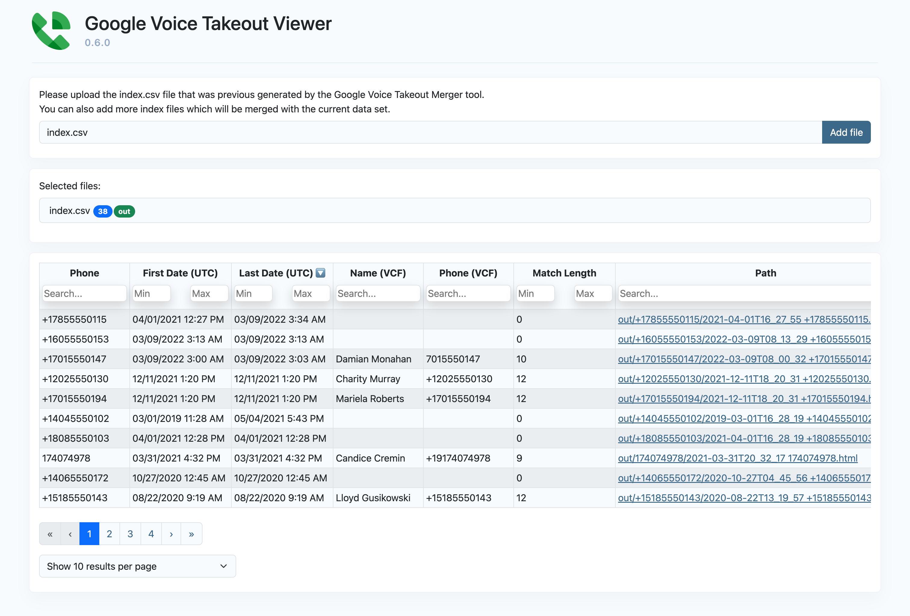

# Google Voice Takeout Viewer

[](https://github.com/lbeder/google-voice-takeout-viewer)
[](https://github.com/lbeder/google-voice-takeout-viewer/actions/workflows/ci.yml)
[](https://github.com/lbeder/google-voice-takeout-viewer/blob/master/LICENSE)

This project is a React app which is used to view and process the index generated by the [Google Voice Takeout Viewer](https://github.com/lbeder/google-voice-takeout-merger) tool:

<kbd>
  
</kbd>

## Installation

```sh
yarn install
```

## Usage

You can run the app in local development mode:

```sh
yarn start
```

Alternatively, you can build the app as a static HTML page:

```sh
yarn build

# On Linux/Max
open ./build/index.html

# On Windows
start ./build/index.html
```

Please note that the path of each log is relative to its output folder, therefore if you want to open them via the static `build/index.html` page, you should copy the output folder to the `build` folder (otherwise the relative URLs won't point to te right location on the local filesystem). Due to this limitation, opening these paths in development mode isn't supported.
